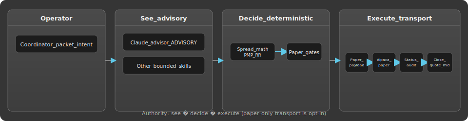
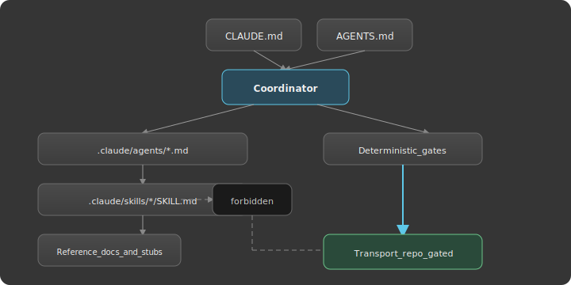

# KIDWEEL

## What breaks first?

Options markets are unforgiving and complex. The failure mode is usually **inconsistency**—a skipped check, a loose quote, a helper that drifts into permission—not missing intelligence.

Kidweel is an operator-built loop for one decision path: context becomes structured candidates, deterministic gates decide what may continue, and **paper transport** carries only approved payloads when you explicitly opt in. Supporting tools (Claude, subagents, ML review) help you **form better questions**. They do not get to force the answer.

**Technically, this is a deterministic paper-live options decision system.** Under the hood: playbooks, Option Alpha–style spread math, PMP/reward–risk gates, approval handoffs, limit multileg payloads, Alpaca **paper** submit, post-submit audits, and quote-based close pricing—not market prediction.

Automation creates leverage. Constraints determine whether that leverage survives scale.

---

## Proof on paper (operating loop)

This repo is judged by a traceable path, not by a headline:

1. **Paper-live candidates** — staged spreads from fixed playbooks and structure rules  
2. **PMP / RR / EV** — deterministic spread math before any advisory or transport handoff  
3. **Approval** — rows at `APPROVED_FOR_PAPER_REVIEW` only ([paper approval candidates](./docs/paper-approval-candidates.md))  
4. **Payload** — `mleg` limit, day orders shaped for transport ([paper payloads](./docs/paper-payload-candidates.md))  
5. **Paper submit** — repo-native Alpaca paper bridge; default **dry-run**; real submit requires explicit `--submit-paper` ([alpaca paper bridge](./docs/alpaca-paper-bridge.md))  
6. **Fill audit** — read-only order status check after submit ([paper order status audit](./docs/paper-order-status-audit.md))  
7. **Quote-mid close** — controlled multileg close after verified fill; entry fill is not used as close price ([paper closeout](./docs/paper-closeout.md))

Notebook contrast (limit mleg vs notebook market/heuristics): [docs/notebook-alignment.md](./docs/notebook-alignment.md).

Claude proposes. The system decides. Transport executes.

---

## What this is

- A constrained operating loop: context → playbook → structure → validation → payload → paper transport → response → audit  
- SpotGamma-oriented ingestion and environment classification within **fixed** playbooks  
- Deterministic gates (playbook policy, RR, PMP/EV, paper execution gate, MCP paper gate on the narrow contract path)  
- Iterative backtest scaffolding (PnL, profit factor, Sharpe, drawdown / stop-rate, playbook segmentation, validation status)  
- A **bounded** Claude layer and required ML/subagent advisory (interpretation and flags—not approval or transport)  
- **Repo-native Alpaca paper bridge** (opt-in submit) plus offline mock MCP path (C11A) and external Alpaca MCP **transport contract** scaffold (C10A)

## What this is not

- **Not** live trading or a broker-side brain  
- **Not** unattended execution—submit and close require explicit flags and paper credentials  
- **Not** an assistant with order authority, position management, or cancel/replace automation  
- **Not** unrestricted order submission  

The problem is not getting systems to act. It is getting them to act **consistently** within enforceable constraints.

---

## System loop

  

**Data path:** `Context → playbook → structure → validation → payload → paper transport → response → audit`

SpotGamma and related context feed screening and playbook selection. Structure and risk modules produce approved handoffs only when gates pass. The **repo-owned paper bridge** carries approved payloads when opted in; MCP remains a **transport-only** contract, not a decision layer. Audits record gate outcomes, broker responses, and normalized status.

---

## Current status

| Capability | Status |
|------------|--------|
| Deterministic core (playbooks, RR/PMP, structure) | In repo |
| Backtest evidence & Claude research comparisons | In repo |
| Paper execution payload + gates | In repo |
| **Repo-native Alpaca paper bridge** | **Implemented** — opt-in (`--submit-paper`); paper-only; fail-closed URL |
| **External Alpaca MCP transport contract** | **Scaffolded / future** — C10A typed contract; C11A offline mock; not broker judgment |
| **Paper order status audit** | **Implemented** — read-only post-submit |
| **Quote-mid close pricing** | **Implemented** — CLOSE-C1B; dry-run default |
| **Advisory groups** | **Named** — docs expanding ([advisory group matrix](./docs/advisory-group-matrix.md)) |
| **Claude skills / subagency footing** | **Implemented** — bounded manifests and skills ([subagency proof](./docs/subagency-proof.md)) |
| Live trading | **Out of scope** |

---

## Advisory lenses (thesis vs permission)

Markets offer more than one plausible story. Kidweel separates **comparing theses** from **permission to trade**.

Three named advisory groups (matrix and SpotGamma model docs still expanding):

| Group | Role (advisory only) |
|-------|----------------------|
| `SQUEEZE_CANDIDATES` | Squeeze / positioning stress lens on supplied context |
| `VOLATILITY_RISK_PREMIUM` | Short-vol / carry-style risk premium lens |
| `REVERSE_RISK_PREMIUM` | Skew / reversal-style lens |

The **claude-advisor** skill maps coordinator-supplied context to a single primary label (`ADVISORY_OK`, `ADVISORY_CAUTION`, `ADVISORY_DOWNGRADE`, `ADVISORY_SKIP`). It may suggest bounded spread **ideas** within canonical structures—proposals only. Missing context is reported; fields are not invented ([claude advisor context](./docs/claude-advisor-context.md)).

Deterministic spread math, playbooks, and paper gates remain the decision owner. **More agents do not mean more authority.**

---

## Structure and advisory policy

Canonical structure and ML/subagent rules: [docs/system-identity.md](./docs/system-identity.md).

**Structure:** The spread builder may emit `BULL_CALL_SPREAD`, `BEAR_PUT_SPREAD`, `BULL_PUT_CREDIT_SPREAD`, `BEAR_CALL_CREDIT_SPREAD`, or `SKIP`. No parked structures. Executable paths are multi-leg, risk-defined spreads only. Single-leg long calls or puts are for context, not canonical execution.

**ML / subagents:** Required advisory layers—they score, flag, compare expressions, downgrade confidence, and may recommend `SKIP`. They do not override gates, mutate thresholds, or call transport.

Paper-only execution remains mandatory.

---

## Claude boundary

Claude may interpret context (skew, liquidity, deteriorating reward/risk, debit vs credit posture) and propose **bounded** spread alternatives only within the canonical structure set above.

Claude **cannot** approve trades, size positions, execute orders, bypass validation, or call broker transport.

---

## Paper and MCP transport boundary

- **The repo owns approval.** Broker and MCP surfaces are **transport only**—they do not decide sizing, structure, or whether a row continues.
- **Repo-native paper bridge** — `examples/submit_paper_payload_candidates.py`; `ALPACA_PAPER_*`; canonical base URL `https://paper-api.alpaca.markets`; deterministic `client_order_id`; no blind auth retry.
- **C10A** ([transport contract](./integrations/alpaca_mcp/transport_contract.md)) — narrow request/response shape for a future external Alpaca MCP paper path.
- **C11A** — offline mock bridge: gate → mock transport → normalize → audit (no network). Do not confuse with production MCP I/O.

Transport executes; it does not decide.

---

## Backtest evidence

The backtest layer produces comparative evidence: trade counts, profit factor, Sharpe, drawdown-related metrics, stop-rate, playbook segmentation, and validation status (`eligible_for_paper`, research-mode exceptions). Claude overlay paths are **research-only**—they do not change approval or paper gates.

Example (limited sample): [docs/findings-c13-claude-context.md](./docs/findings-c13-claude-context.md).

---

## Constraint Survivability

As automation scales, systems need **enforceable constraints**. AI can generate actions; constraint systems determine which actions are allowed.

Paper trading here is a **proof environment** for those boundaries: same gates whether one tool or many assist the operator. See [docs/system-identity.md](./docs/system-identity.md).

---

## Why this matters beyond trading

Wherever software can **act**, teams need a clear rule for **when it may act**. This repo demonstrates that pattern in a strict, paper-only options loop. **No enterprise products are integrated here in production**—the lesson is architectural: propose → decide → execute, with audits.

---

## Subagency proof

  

Kidweel delegates **bounded** work to project skills and subagents under a human-directed coordinator—without granting transport authority ([subagency proof](./docs/subagency-proof.md), [AGENTS.md](./AGENTS.md)).

**Subagents help the system see.** They do not help the system act.

**Subagents may propose:** classification, doc diffs, safety tables, advisory flags, bounded structure ideas, caution notes, `SKIP` recommendations.

**Subagents may not:** approve trades, create execution payloads, bypass gates, mutate playbooks or thresholds, or call broker or MCP order tools.

**Same validation path:**

1. Advisory or skill output (see only)  
2. Deterministic validator and risk gates (decide)  
3. Transport carries only approved payloads (execute)  
4. Audit records the path  

Swarm-safe behavior means every assistant hits the same gates—not more authority per assistant.

---

## Safety posture

- Paper-only execution path; fail-closed gates  
- No live trading logic in capstone rules; live Alpaca endpoint forbidden for transport  
- No broker/network I/O without explicit opt-in flags and an approved packet scope  
- Schemas and playbooks are contracts—do not bypass or re-derive protected fields in automation  
- External Alpaca MCP paper I/O remains a future explicit packet; repo paper bridge is separate and paper-only  

---

## Repository navigation

**Governance & identity**

  
  
  
  
  

**Paper path**

  
  
  
  

**Claude & advisory**

  
  
  
  
  

**Integrations & diagrams**

  
  
  
  

