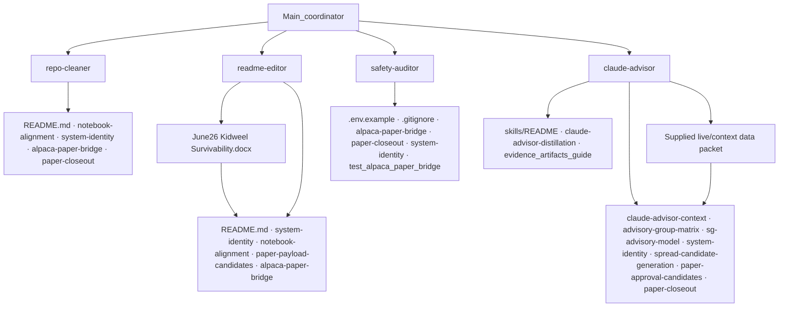

# Subagency proof (SUBAGENCY-PROOF-C1)

Minimal Claude/Cursor **skill-style** proof that Kidweel can delegate bounded work without granting execution authority. This packet is documentation and project skills only—not a swarm, not autonomous routing, not MCP transport, not paper trading.

**Related:** [subagent-governance.md](./subagent-governance.md), [claude-advisor-context.md](./claude-advisor-context.md)

---

## What this proves

Subagents and project skills prove **bounded delegation**, not autonomy.

| Proven | Not proven |
|--------|------------|
| Coordinator assigns a skill with named reference docs | Self-routing agent mesh |
| Skill returns a structured report (table, diff proposal, advisory flag) | Order submit or paper transport |
| Advisory interprets supplied context | Gate or threshold mutation |
| Stop on missing context | Invented fallback behavior |

---

## Governance (unchanged)

1. **Only the coordinator delegates.** The human-directed main session chooses which skill to invoke and supplies the packet scope.
2. **Subagents do not spawn subagents.** Skills do not invoke the Agent tool or nested Task delegation.
3. **Advisory cannot become execution.** Interpretive output (`ADVISORY_*` flags, memos, classification) does not approve, size, or route orders.
4. **No subagent or skill receives paper transport authority.** Alpaca MCP, `--submit-paper`, close/cancel/replace, and payload creation stay on the deterministic coordinator path.

This is **not** execution. This is **not** MCP transport. This is **not** paper trading. This is **not** autonomous agent routing.

---

## Skill layout

Project skills live under `.claude/skills/<name>/SKILL.md` (Claude Code skill format). Cursor can mirror the same content in `.cursor/skills/` in a future packet if needed.

| Skill | Invocation | Output |
|-------|------------|--------|
| [repo-cleaner](../.claude/skills/repo-cleaner/SKILL.md) | Explicit only (`disable-model-invocation: true`) | Classification table |
| [readme-editor](../.claude/skills/readme-editor/SKILL.md) | Explicit only | Proposed README diff |
| [safety-auditor](../.claude/skills/safety-auditor/SKILL.md) | Explicit only | Safety table |
| [claude-advisor](../.claude/skills/claude-advisor/SKILL.md) | May auto-invoke when relevant (`disable-model-invocation: false`) | `ADVISORY_*` flags + brief rationale |

Each skill names its reference docs and stops when references or coordinator context are missing.

---

## Reference docs discipline

Each skill must include a **Reference docs** section.

The skill may only use those docs plus the **delegated packet context**.

If the reference docs do not contain enough information, the skill must **report missing context and stop**.

- Do not infer new architecture.
- Do not invent implementation details.
- Do not broaden scope.

### Skill reference map

| Skill | Reference docs |
|-------|----------------|
| **repo-cleaner** | `README.md`, `docs/notebook-alignment.md`, `docs/system-identity.md`, `docs/alpaca-paper-bridge.md`, `docs/paper-closeout.md` |
| **readme-editor** | `June26 Kidweel Survivability.docx`, `README.md`, `docs/system-identity.md`, `docs/notebook-alignment.md`, `docs/paper-payload-candidates.md`, `docs/alpaca-paper-bridge.md`, `docs/paper-closeout.md`, `docs/subagency-proof.md` |
| **safety-auditor** | `.env.example`, `.gitignore`, `docs/alpaca-paper-bridge.md`, `docs/paper-closeout.md`, `docs/system-identity.md`, `tests/test_alpaca_paper_bridge.py`, `tests/test_paper_closeout.py` |
| **claude-advisor** | `docs/claude-advisor-context.md`, `docs/evidence_artifacts_guide.md`, `docs/skills/README.md`, `docs/skills/claude-advisor-distillation.md`, `docs/advisory-group-matrix.md`, `docs/sg-advisory-model.md`, `docs/advisory-group-layer.md`, `docs/system-identity.md`, `docs/spread-candidate-generation.md`, `docs/paper-approval-candidates.md`, `docs/paper-closeout.md`, **supplied live/context data** (coordinator packet only) |

If a listed file is absent from the workspace, the skill reports it as missing context and stops—not an invitation to substitute other sources.

**Narrative anchor:** [June26 Kidweel Survivability.docx](../June26%20Kidweel%20Survivability.docx) lives at the repo root. It is in the **readme-editor** reference tree only (operator voice, Constraint Survivability framing, artifact conversion). It does not override paper-only rules in `docs/system-identity.md` or transport docs.

### Skill trees

Delegation is a shallow tree: **coordinator → one skill → reference docs + packet**. Skills do not branch to other skills.



| Skill | Tree role | Primary leaf |
|-------|-----------|--------------|
| repo-cleaner | Classify repo layout vs docs | `docs/notebook-alignment.md` |
| readme-editor | Narrative/README alignment | `June26 Kidweel Survivability.docx` |
| safety-auditor | Env/endpoint/paper boundary audit | `docs/alpaca-paper-bridge.md` |
| claude-advisor | Interpretive advisory flags | Coordinator-supplied context + `docs/claude-advisor-context.md` |

Skill definitions: [.claude/skills/](../.claude/skills/).

---

## Verification commands

```bash
find .claude/skills -name SKILL.md -maxdepth 3 -print
grep -R "disable-model-invocation" .claude/skills docs/subagency-proof.md docs/claude-advisor-context.md
```

No Python tests are required for this docs/skills-only packet.

---

## Swarm-safe routing (system remains owner)

1. Agent or skill proposes (classification, doc diff, advisory flag)  
2. Deterministic validator checks  
3. Risk gate approves or rejects  
4. Transport carries only approved payloads  
5. Audit records the path  

Skills sit at step 1 only when the coordinator invokes them.
