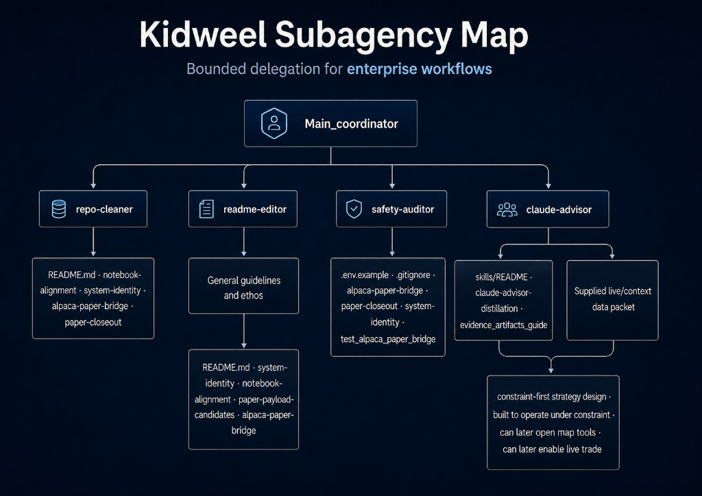
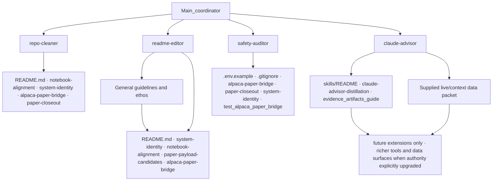

# Subagency proof (SUBAGENCY-PROOF-C2)

Bounded delegation proof for Kidweel: coordinator-directed skills that do bounded work without inheriting execution authority. Documentation and project skills only—not a swarm, not autonomous routing, not open transport.

**Related:** [subagent-governance.md](./subagent-governance.md), [claude-advisor-context.md](./claude-advisor-context.md)

---

## Public frame

Kidweel demonstrates **bounded delegation for enterprise workflows**.

Agents assist with scoped work.

Humans remain in the decision path.

The process records why.

This is the proof: useful delegation without inherited authority.

---

## Portability ethos

The pattern travels because it separates work from authority.

- Agents handle scoped work.
- Humans retain decision authority.
- Audit trails record the path.

---

## Future extensions

The same pattern can support richer tools, data surfaces, and execution pathways only when authority boundaries, validators, and audit trails are explicitly upgraded.

Do not imply current live-trade authority.

Paper validation remains one current boundary layer where the repo exercises transport contracts; it is not the core identity of this proof.

---

## Visual portability

Approved public map (README, splash, LinkedIn): [`diagrams/kidweel_subagency_map.png`](../diagrams/kidweel_subagency_map.png) · [splash](../kidweel-site/index.html).

| Field | Copy |
|-------|------|
| **Title** | Kidweel Subagency Map |
| **Subtitle** | Bounded delegation for enterprise workflows |
| **Caption** | Constraint-first strategy design. Expandable only through explicit authority upgrades. |

The map is shallow by design: **Main_coordinator** → four explicit skills → reference leaves. Only **claude-advisor** terminates in a **future extensions** node (richer tools and data surfaces when authority is explicitly upgraded)—not current capability.

<p align="center">
  <a href="../diagrams/kidweel_subagency_map.png">
    
  </a>
</p>

---

## What this proves

Subagents and project skills prove **bounded delegation**, not autonomy.

| Proven | Not proven |
|--------|------------|
| Coordinator assigns a skill with named reference docs | Self-routing agent mesh |
| Skill returns a structured report (table, diff proposal, advisory flag) | Approval, sizing, or transport |
| Advisory interprets supplied context | Gate or threshold mutation |
| Stop on missing context | Invented fallback behavior |

**Agents may:**

- inspect scoped artifacts
- propose diffs or classifications
- flag missing context

**Agents may not:**

- approve outcomes
- mutate gates
- inherit transport authority

---

## Governance (unchanged)

1. **Only the coordinator delegates.** The human-directed main session chooses which skill to invoke and supplies the packet scope.
2. **Subagents do not spawn subagents.** Skills do not invoke the Agent tool or nested Task delegation.
3. **Advisory cannot become execution.** Interpretive output (`ADVISORY_*` flags, memos, classification) does not approve, size, or route orders.
4. **Skills stop when references or packet context are missing.** No invented fallbacks or scope expansion.
5. **Transport stays on the deterministic path.** Alpaca MCP, submit/close/cancel/replace, and payload handoff require coordinator gates—not skill output.

Skills sit at the proposal/advisory step only when the coordinator invokes them.

---

## Skill layout

Project skills live under `.claude/skills/<name>/SKILL.md` (Claude Code skill format). Cursor can mirror the same content in `.cursor/skills/` in a future packet if needed.

| Skill | Invocation | Output |
|-------|------------|--------|
| [repo-cleaner](../.claude/skills/repo-cleaner/SKILL.md) | Explicit only (`disable-model-invocation: true`) | Classification table |
| [readme-editor](../.claude/skills/readme-editor/SKILL.md) | Explicit only | Proposed README diff |
| [safety-auditor](../.claude/skills/safety-auditor/SKILL.md) | Explicit only | Safety table |
| [claude-advisor](../.claude/skills/claude-advisor/SKILL.md) | May auto-invoke when relevant (`disable-model-invocation: false`) | `ADVISORY_*` flags + brief rationale |

Each skill names its reference docs and stops when references or coordinator context are missing.

---

## Reference docs discipline

Each skill must include a **Reference docs** section.

The skill may only use those docs plus the **delegated packet context**.

If the reference docs do not contain enough information, the skill must **report missing context and stop**.

- Do not infer new architecture.
- Do not invent implementation details.
- Do not broaden scope.

### Skill reference map

| Skill | Reference docs |
|-------|----------------|
| **repo-cleaner** | `README.md`, `docs/notebook-alignment.md`, `docs/system-identity.md`, `docs/alpaca-paper-bridge.md`, `docs/paper-closeout.md` |
| **readme-editor** | General guidelines and ethos (operator packet when supplied), `README.md`, `docs/system-identity.md`, `docs/notebook-alignment.md`, `docs/paper-payload-candidates.md`, `docs/alpaca-paper-bridge.md`, `docs/paper-closeout.md`, `docs/subagency-proof.md` |
| **safety-auditor** | `.env.example`, `.gitignore`, `docs/alpaca-paper-bridge.md`, `docs/paper-closeout.md`, `docs/system-identity.md`, `tests/test_alpaca_paper_bridge.py`, `tests/test_paper_closeout.py` |
| **claude-advisor** | `docs/claude-advisor-context.md`, `docs/evidence_artifacts_guide.md`, `docs/skills/README.md`, `docs/skills/claude-advisor-distillation.md`, `docs/advisory-group-matrix.md`, `docs/sg-advisory-model.md`, `docs/advisory-group-layer.md`, `docs/system-identity.md`, `docs/spread-candidate-generation.md`, `docs/paper-approval-candidates.md`, `docs/paper-closeout.md`, **supplied live/context data** (coordinator packet only) |

If a listed file is absent from the workspace, the skill reports it as missing context and stops—not an invitation to substitute other sources.

**Narrative anchor:** **General guidelines and ethos** (readme-editor leaf on the map) is operator voice and human-in-the-loop framing when the coordinator supplies it in packet context. It does not override execution boundaries in `docs/system-identity.md` or transport docs.

### Skill trees

Delegation is a shallow tree: **coordinator → one skill → reference docs + packet**. Skills do not branch to other skills.

Schematic matches the approved map above (repo file lists stay in the skill reference map table).



| Skill | Tree role | Primary leaf |
|-------|-----------|--------------|
| repo-cleaner | Classify repo layout vs docs | `docs/notebook-alignment.md` |
| readme-editor | General guidelines and ethos | `README.md` + coordinator-supplied ethos packet |
| safety-auditor | Env/endpoint/transport boundary audit | `docs/alpaca-paper-bridge.md` |
| claude-advisor | Interpretive advisory flags | Future-extensions terminal (see map) |

Skill definitions: [.claude/skills/](../.claude/skills/).

---

## Verification commands

```bash
find .claude/skills -name SKILL.md -maxdepth 3 -print
grep -R "disable-model-invocation" .claude/skills docs/subagency-proof.md docs/claude-advisor-context.md
```

No Python tests are required for this docs/skills-only packet.

---

## Swarm-safe routing (system remains owner)

1. Agent or skill proposes (classification, doc diff, advisory flag)  
2. Deterministic validator checks  
3. Risk gate approves or rejects  
4. Transport carries only approved payloads  
5. Audit records the path  

Skills sit at step 1 only when the coordinator invokes them.
